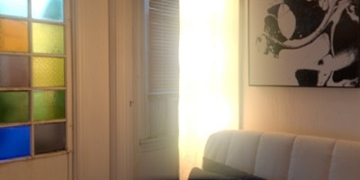
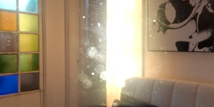

LightBloom
========
Bloom is an image effect for MikuMikuDance, it can help to hint the relative brightness of objects or add beauty and atmospheric.

Requirements:
-----------
* MikuMikuDance (Only tested on 926 version x64)
* MikuMikuEffect (Only tested on 037 version x64)
* Direct3D 9 With Shader Model 3.0 (ps_3_0)

Quickstart:
-----------
* Download a zip archive from the github page.
* Un-zip the archive.
* Put the the `LightBloom.x` or `LightBloom with DirtMap.x` to the MMD window.
* Put `LightBloomController.pmx` to the MMD window.
* Drag the `BloomThreshold` to 0.5 in the morph panel

Effect Params:
-----------
* `BloomThreshold` - Fetch out pixels higher than this level of brightness.
* `BloomRadius` - Controls the size of veiling effects in percent of the screen width.
* `BloomColorAllHSV` - Scales the brightness and color of the whole bloom effect (linear color-space with HSV color)
* `Bloom1st~5st HSV` - Modifies the brightness and color of the bloom in the each layer, if you need a larger bloom, use higher layer instead
* `DirtColorHSV` - Scales the brightness and color of the whole dirt map

Dirt Mask:
-----------
`Dirt Mask` is a effect to create a camera imperfections (Left: only bloom, right: Bloom with Dirt Mask) and give more impressive HDR effect. You can see UE4 ([docs](https://docs.unrealengine.com/latest/INT/Engine/Rendering/PostProcessEffects/Bloom/index.html)) for more information

Contact :
------------

* Reach me via Twitter: [@Rui](https://twitter.com/Rui_cg).

[License (MIT)](https://raw.githubusercontent.com/MikuMikuShaders/LightBloom/master/LICENSE.txt)
-------------------------------------------------------------------------------
	Copyright (C) 2016-2017 Rui. All rights reserved.

	https://github.com/MikuMikuShaders

	Permission is hereby granted, free of charge, to any person obtaining a
	copy of this software and associated documentation files (the "Software"),
	to deal in the Software without restriction, including without limitation
	the rights to use, copy, modify, merge, publish, distribute, sublicense,
	and/or sell copies of the Software, and to permit persons to whom the
	Software is furnished to do so, subject to the following conditions:

	The above copyright notice and this permission notice shall be included
	in all copies or substantial portions of the Software.

	THE SOFTWARE IS PROVIDED "AS IS", WITHOUT WARRANTY OF ANY KIND, EXPRESS
	OR IMPLIED, INCLUDING BUT NOT LIMITED TO THE WARRANTIES OF MERCHANTABILITY,
	FITNESS FOR A PARTICULAR PURPOSE AND NONINFRINGEMENT.  IN NO EVENT SHALL
	BRIAN PAUL BE LIABLE FOR ANY CLAIM, DAMAGES OR OTHER LIABILITY, WHETHER IN
	AN ACTION OF CONTRACT, TORT OR OTHERWISE, ARISING FROM, OUT OF OR IN
	CONNECTION WITH THE SOFTWARE OR THE USE OR OTHER DEALINGS IN THE SOFTWARE.

References:
------------
* How to do good bloom for hdr rendering \[[link](http://kalogirou.net/2006/05/20/how-to-do-good-bloom-for-hdr-rendering/)\]