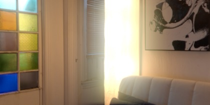
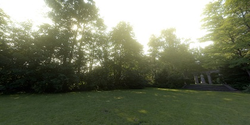
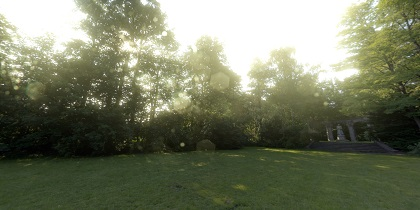

泛光
========
###### 　　[English](https://github.com/MikuMikuShaders/LightBloom/blob/master/README.md) &nbsp; [中文文档](https://github.com/MikuMikuShaders/LightBloom/blob/master/README_chs.md)
　　泛光是一个为了mikumikudance编写的图像特效, 对过亮的像素执行模糊来添加更多的真实性.

蒙板:
-----------
`蒙板` 用于创建相机残缺来体现镜头的不完美，来给与更多的真实性 (`左边`: 只有泛光, `右边`: 泛光和蒙板的叠加). 更多的了解你可以看UE的([文档](https://docs.unrealengine.com/latest/CHN/Engine/Rendering/PostProcessEffects/Bloom/index.html))

需求:
-----------
* MikuMikuDance (Only tested on 926 version x64)
* MikuMikuEffect (Only tested on 037 version x64)
* Direct3D 9 With Shader Model 3.0 (ps_3_0)

快速开始:
-----------
* 从Github页面中下载并且解压该文件.
* 放置该目录中的`LightBloom.x` 或者 `LightBloom with DirtMap.x` 到MMD的窗口.
* 放置该目录中的`LightBloomController.pmx` 到MMD的窗口.
* 拖拽标签栏中的`BloomThreshold` 到 0.5

影响参数:
-----------
* `BloomThreshold` - 定义一个阈值用于提取超出一定范围的亮度执行泛光.
* `BloomRadius` - 控制泛光模糊的大小.
* `BloomColorAllHSV` - 修改所有模糊层的亮度和颜色 (使用线性的HSV的色彩)
* `Bloom1st~5st HSV` - 修改单个模糊层从内到外的亮度和颜色 (调节高数值的模糊层，可以使泛光产生的半径更大)
* `DirtColorHSV` - 调教蒙板产生的亮度和颜色

联系:
------------
　　如果你是一名热爱图形的开发者，你可以通过`Pull requests`来提交你的代码，或者通过Github的Issue和twitter来加入到我们的团队

* Twitter: [@Rui](https://twitter.com/Rui_cg).

[协议 (MIT)](https://raw.githubusercontent.com/MikuMikuShaders/LightBloom/master/LICENSE.txt)
-------------------------------------------------------------------------------
	Copyright (C) 2016-2017 Rui. 保留所有版权.

	https://github.com/MikuMikuShaders

	被授权人权利:
	被授权人有权利使用、复制、修改、合并、出版发行、散布、再授权及贩售软件及软件的副本。
	被授权人可根据程序的需要修改授权条款为适当的内容。

	被授权人义务:
	在软件和软件的所有副本中都必须包含版权声明和许可声明。由版权持有人及其他责任者“按原样”提供，包括
	但不限于商品的内在保证和特殊目的适用，将不作任何承诺，不做任何明示或暗示的保证。 在任何情况下，不
	管原因和责任依据，也不追究是合同责任、后果责任或侵权行为(包括疏忽或其它)，即使被告知发生损坏的可
	能性，在使用本软件的任何环节造成的任何直接、间接、偶然、特殊、典型或重大的损坏(包括但不限于使用替
	代商品的后果：使用、数据或利益的损失或业务干扰)，版权持有人、其他责任者或作者或所有者概不承担任何责任

	其他重要特性:
	此授权条款并非属Copyleft的自由软件授权条款，允许在自由/开放源码软件或非自由软件（proprietary software）所使用。
	MIT的内容可依照程序著作权者的需求更改内容。此亦为MIT与BSD（The BSD license, 3-clause BSD license）本质上不同处。
	MIT条款可与其他授权条款并存。另外，MIT条款也是自由软件基金会（FSF）所认可的自由软件授权条款，与GPL兼容

引用:
-----------
* Chromatic Aberration \[[link](https://twitter.com/nnnnoby/status/818710634682585088)\]
